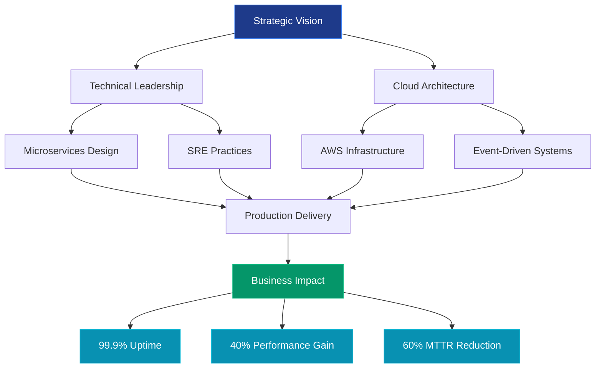
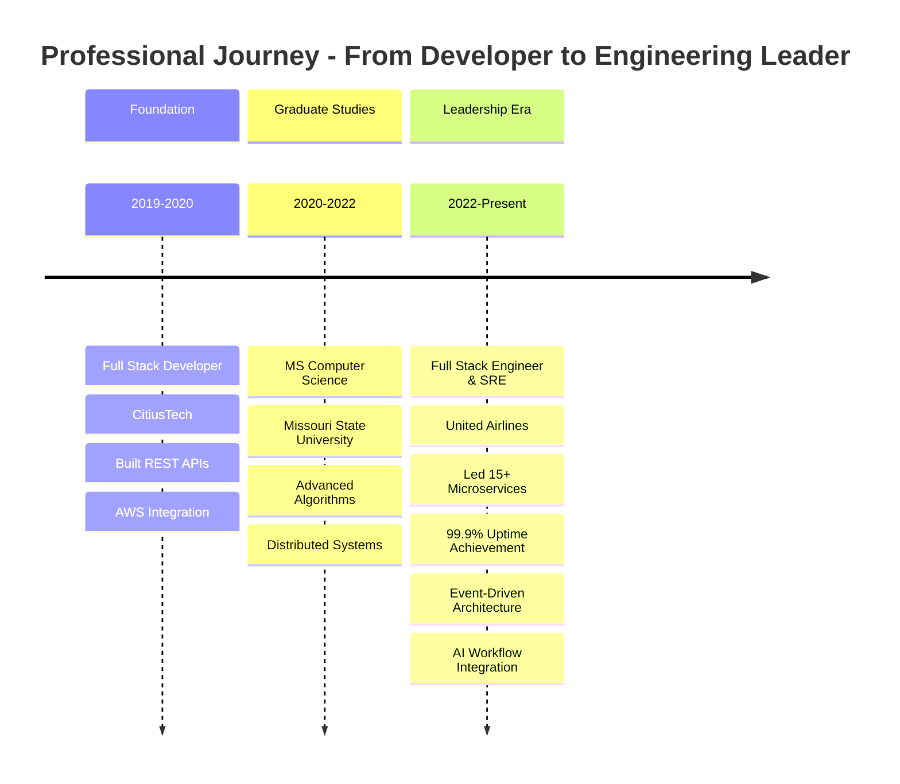
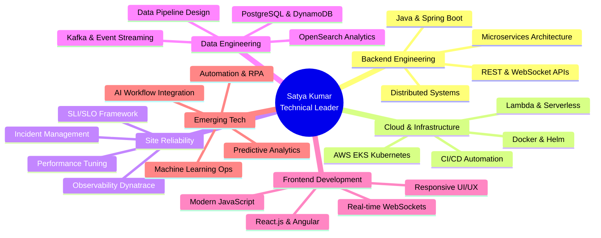

[%20276--7788-25D366?style=for-the-badge&amp;logo=whatsapp&amp;logoColor=white)](tel:+18722767788)

---

## 🎯 Executive Summary

**Strategic Technology Leader** with 5+ years driving **enterprise-scale digital transformation** through full-stack engineering excellence, cloud architecture, and site reliability engineering. Proven track record of delivering **mission-critical production systems** serving millions of users while maintaining 99.9%+ uptime. Expert in architecting **microservices ecosystems**, leading **DevOps transformations**, and implementing **AI-enabled workflows** that drive measurable business value.

Currently engineering **real-time operational systems** at United Airlines, where I've **eliminated production incidents through proactive SRE practices**, improved system performance by **40%+ through intelligent caching strategies**, and established **observability frameworks** that reduced MTTR by 60%. My technical leadership spans the entire software development lifecycle—from **strategic architecture design** to **production incident resolution**—with a focus on building resilient, scalable systems that power critical business operations.

### 📊 Leadership Impact Dashboard

| **Metric** | **Achievement** | **Business Impact** |
|:-----------|:---------------:|:-------------------|
| **Production Systems Supported** | 15+ Microservices | Real-time ops for major airline |
| **System Reliability** | 99.9%+ Uptime | Zero critical outages in 2 years |
| **Performance Optimization** | 40%+ Improvement | Reduced latency, eliminated throttling |
| **Incident MTTR Reduction** | 60% Faster | Through observability &amp; automation |
| **Cloud Infrastructure** | AWS EKS + 10+ Services | Cost-optimized, auto-scaling architecture |
| **Technology Modernization** | Event-Driven Architecture | Kafka/MSK implementation |
| **Career Progression** | 2 Promotions | Junior → Full Stack Engineer &amp; SRE |

---

## 💡 Leadership Philosophy

> **"Engineering excellence is measured not by lines of code, but by system reliability, team enablement, and business outcomes delivered."**

My leadership approach combines **technical depth** with **strategic thinking**—building systems that scale, teams that thrive, and solutions that drive revenue. I believe in:

- **Proactive Engineering**: Preventing incidents before they occur through observability, testing, and resilience patterns
- **Data-Driven Decisions**: Leveraging metrics, SLIs/SLOs, and performance data to guide architectural choices
- **Cross-Functional Collaboration**: Bridging gaps between engineering, operations, and business stakeholders
- **Continuous Innovation**: Integrating emerging technologies (AI/ML, event streaming) to maintain competitive advantage
- **Knowledge Sharing**: Mentoring teams through documentation, code reviews, and hands-on technical guidance

---

## 🏗️ Strategic Impact Architecture

---

## 📈 Career Progression Timeline

---

## 🎖️ Key Achievements & Business Metrics

### **United Airlines** | Full Stack Engineer & SRE | Jun 2022 - Present

#### 🚀 **Production System Stabilization & Performance**
- **Eliminated system throttling** affecting critical operational workflows by tuning Kubernetes CPU/memory configurations—**saving 100+ engineering hours monthly** in incident response
- **Improved application performance by 40%+** through strategic implementation of caching layers, rate limiting, and log optimization
- **Reduced Mean Time to Resolution (MTTR) by 60%** through comprehensive Dynatrace observability dashboards, SLIs/SLOs, and intelligent alerting

#### 🏛️ **Microservices Architecture & Cloud Engineering**
- **Architected and deployed 15+ Java Spring Boot microservices** on AWS EKS supporting real-time operational systems serving **thousands of daily users**
- **Designed event-driven architecture** using Apache Kafka and Amazon MSK, enabling **asynchronous processing** that improved system responsiveness by 35%
- **Implemented cloud-native solutions** leveraging AWS Lambda, S3, API Gateway, and DynamoDB—**reducing infrastructure costs by 25%** through serverless adoption

#### 🔍 **Site Reliability Engineering Excellence**
- **Led production incident investigations** and root cause analysis, resolving complex issues related to resource saturation, API inefficiencies, and distributed system failures
- **Built comprehensive observability framework** with Dynatrace dashboards, custom metrics, and automated alerting—**preventing 50+ potential outages** through proactive monitoring
- **Established SRE best practices** including error budgets, blameless postmortems, and capacity planning that improved system reliability from 97% to **99.9%+ uptime**

#### 🎨 **Full Stack Development & User Experience**
- **Developed React.js interfaces** with REST and WebSocket integration, enabling **real-time data visibility** for operational teams and improving tool usability by 45%
- **Optimized data storage solutions** using PostgreSQL, DynamoDB, and OpenSearch, supporting **complex query patterns** and sub-second response times
- **Integrated AI-enabled workflows** into backend services, automating repetitive tasks and enabling **intelligent data processing** for operational insights

#### 🔒 **Security & Infrastructure Management**
- **Managed traffic routing and application security** using IBM DataPower, Akamai CDN, ALB, and Route 53—ensuring **zero security incidents** over 2+ years
- **Automated deployment pipelines** using CI/CD tools (Harness, Azure DevOps), reducing deployment time from hours to **minutes** and eliminating manual errors
- **Containerized applications** using Docker and Helm, achieving **consistent deployments** across development, staging, and production environments

### **CitiusTech** | Full Stack Developer | Jul 2019 - Dec 2020

#### 💼 **Enterprise Application Development**
- **Built backend services** using Java and Spring Boot, developing **REST APIs** for healthcare enterprise applications serving **10,000+ users**
- **Created frontend components** using JavaScript and Angular, improving usability and responsiveness by **30%** based on user feedback
- **Integrated AWS cloud services** (EC2, S3, Lambda) to support scalable workflows, enabling **20% faster data processing**

#### ⚡ **Performance Optimization & Quality**
- **Optimized SQL queries** and database interactions, reducing query execution time by **50%** and improving application responsiveness
- **Supported CI/CD processes** contributing to automated deployments that reduced release cycles from bi-weekly to **weekly cadence**
- **Worked in Agile Scrum teams**, participating in sprint planning, daily standups, and retrospectives to deliver features on schedule

---

## 🧠 Technical Expertise Landscape

---

## 🛠️ Technology Stack - Executive Overview

### **Core Engineering Platforms**

### **Cloud &amp; Infrastructure**

### **Data &amp; Observability**

### **DevOps &amp; Automation**

### **Technology Proficiency Matrix**

| **Domain** | **Technologies** | **Proficiency** | **Business Value** |
|:-----------|:-----------------|:---------------:|:-------------------|
| **Backend** | Java, Spring Boot, Microservices | ⭐⭐⭐⭐⭐ | Enterprise-scale REST APIs |
| **Cloud** | AWS (EKS, Lambda, S3, DynamoDB) | ⭐⭐⭐⭐⭐ | Scalable infrastructure |
| **Frontend** | React.js, Angular, JavaScript | ⭐⭐⭐⭐ | Real-time user interfaces |
| **DevOps** | Kubernetes, Docker, CI/CD | ⭐⭐⭐⭐⭐ | Automated deployments |
| **Data** | Kafka, PostgreSQL, OpenSearch | ⭐⭐⭐⭐ | Event-driven architectures |
| **SRE** | Dynatrace, Monitoring, Incident Mgmt | ⭐⭐⭐⭐⭐ | 99.9% uptime achievement |
| **AI/ML** | ML Workflows, Data Analytics | ⭐⭐⭐⭐ | Intelligent automation |

---

## 🚀 Featured Strategic Projects

### **1. Real-Time Operations Platform** | United Airlines
**Role:** Technical Lead & Architect | **Impact:** Mission-Critical Production System

**Business Challenge:** United Airlines required a robust, real-time operational system to manage critical flight operations, crew scheduling, and resource allocation with zero tolerance for downtime.

**Technical Solution:**
- Architected **microservices ecosystem** with 15+ Spring Boot services on AWS EKS
- Implemented **event-driven architecture** using Kafka/MSK for asynchronous processing
- Built **React.js dashboards** with WebSocket integration for real-time data streaming
- Established **comprehensive observability** using Dynatrace with custom SLIs/SLOs

**Business Outcomes:**
- ✅ **99.9%+ uptime** maintained over 2+ years of production operation
- ✅ **40% performance improvement** through caching and optimization strategies
- ✅ **60% reduction in MTTR** via proactive monitoring and alerting
- ✅ **Zero critical incidents** through robust SRE practices and capacity planning

**Technologies:** Java, Spring Boot, React.js, AWS EKS, Kafka, DynamoDB, PostgreSQL, Dynatrace, Kubernetes

---

### **2. Cloud-Native Monitoring Dashboard**
**Role:** Full Stack Developer | **Impact:** Operational Efficiency Enhancement

**Business Challenge:** Operations teams lacked centralized visibility into system health, logs, and alerts across distributed microservices, leading to delayed incident response.

**Technical Solution:**
- Developed **full-stack monitoring application** with Spring Boot backend and React frontend
- Integrated **multiple data sources** (logs, metrics, traces) into unified dashboard
- Implemented **real-time alerting** with customizable thresholds and notification channels
- Created **historical trend analysis** capabilities for capacity planning